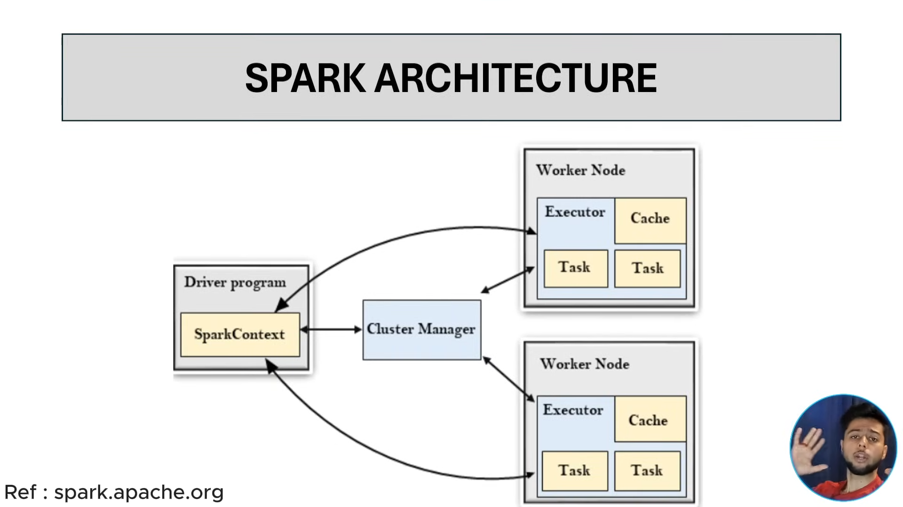

# Pyspark

* PySpark is the Python API for Apache Spark, a powerful framework designed for distributed data processing. If you’ve ever worked with large datasets and found your programs running slowly, PySpark might be the solution you’ve been searching for. It allows you to process massive datasets across multiple computers at the same time, meaning your programs can handle more data in less time.

So, think of PySpark as:

> **Pandas for Big Data**, powered by many computers.


## Why spark is fast?
- Spark keeps most data in RAM, making it much faster.
- Spark splits data into small chunks and processes them simultaneously across multiple computers
- Spark’s DAG (Directed Acyclic Graph) engine automatically finds the best way to run your operations, reducing unnecessary steps.

> stores data in memory + works in parallel + plans smartly.


# Components of spark:
Apache Spark has **five main components**:

1. ⚙️ **Spark Core** –
The foundation of Spark. Handles basic functions like **task scheduling, memory management, fault recovery**, and **interacting with storage**.

2. 🧮 **Spark SQL** –
Used for working with **structured data** using **SQL queries** or **DataFrames** (like tables).

3. 🔥 **Spark Streaming** –
Processes **real-time data streams**, e.g., live logs or sensor data.

4. 🤖 **MLlib (Machine Learning Library)** –
Provides ready-made **machine learning algorithms** like classification, regression, clustering, etc.

5. 🌐 **GraphX** –
Used for **graph processing**, such as analysing social networks or connections.

✅ **In short:**

> Spark Core (base) + SQL + Streaming + MLlib + GraphX = Apache Spark.

# Architecture



---

### 🔷 **1. Driver Program**

* The **main Python application** you write.
* It creates the **SparkContext** (entry point to Spark).
* The driver sends tasks to the cluster and collects results.

---

### 🔷 **2. Cluster Manager**

* Allocates **resources (CPU, memory)** to run your application.
* Examples: **Standalone**, **YARN**, **Mesos**, or **Kubernetes**.

---

### 🔷 **3. Executors**

* Run on **worker nodes**.
* Each executor executes a part of the task and stores data in memory.
* They report results back to the driver.

---

### 🔷 **4. Worker Nodes**

* Machines in the cluster that actually **perform the computation**.

---

### 🔷 **5. RDD / DataFrame**

* The **core data structures** in PySpark used for distributed data processing.

---

**In short:**

> PySpark architecture = **Driver Program** (controls) + **Cluster Manager** (allocates) + **Executors on Worker Nodes** (execute).

It follows a **master–slave architecture**, where the **driver is the master** and **executors are the slaves** performing the actual work.


## Start Session

```python
    from pyspark.sql import SparkSession

    spark = SparkSession.builder \
        .appName("MyApp") \
        .getOrCreate()

    print(spark)          # Should print SparkSession object
    print(spark.version)  # Should print Spark version, e.g., 3.5.0
```


# Create Dataframe


```python
    Name = [("A", 20), ("B", 30), ("C", 40)]
    Column = ["Name", "Age"]

    df = spark.CreateDataFrame(Name, Columns)


    # Visualize using matplotlib

    pdf = df.to_pandas()

    plt.figure(figsize = (6,4))
    plt.bar(pdf["Name"], pdf["Age"])
    plt.xlabel("Name")
    plt.ylabel("Age")

```

## printSchema()

A method that prints the schema in a tree format.

- print(df.printSchema())

## columns

columns → Attribute (not a function) that returns a Python list of column names.

- df.columns

## Count()
count() → method that returns an integer representing the number of rows.

df.count()

## describe

- df.describe() → Computes summary statistics.
- show() → Displays the results in a tabular format.


# READ CSV

```python
    df = spark.read \
        .option("header", "true") \
        .option("inferSchema", "true") \
        .csv("data.csv")
```

- header="true" → first row is column names
- inferSchema="true" → automatically detect data types
- csv("data.csv") → load the CSV file

## ROWS

1. Filtering Rows

    ```python
        #EXAMPLE: 1
        df.filter(df['age'] > 25)
        df.where(df['name'] == 'Ajay')

        df = df.filter((df["Item_Weight"]>10) & (df["Item_Weight"]<13))


        #EXAMPLE: 2
        df = df.where((df["Item_Weight"]>10) & (df["Item_Weight"]<12))
        df.show()
    ```

2. Selecting Rows

    - limit(n) → Take the first n rows.
    - head(n) or take(n) → Returns the first n rows as a list.
    - first() - Return first row

    ```python
        df.limit(5)
        df.head(5)
        df.take(5)
        df.first()
    ```

3. Dropping Rows

    - drop() → Drop a column, not a row.
    - To remove rows with nulls:
        ```python
            df.dropna()                 # drop all rows with any null value
            df.dropna(subset=['age'])   # drop rows where 'age' is null
        ```
    
    - To remove duplicates:

        ```python
            df.dropDuplicates()              # drop exact duplicate rows
            df.dropDuplicates(['name'])      # drop duplicate rows based on 'name'
        ```

4. Adding / Transforming Rows

    - withColumn() → Add or modify a column (row-level operation):

        ```python
            from pyspark.sql.functions import col
            df.withColumn('age_plus_10', col('age') + 10)
        ```

    - replace() = Replace specific values in column

        ```python
            df.replace(old_value, new_value, column_name)
        ```

5. Sampling Rows

    - sample(fraction, seed=None) → Randomly sample rows.
        
        ```python
            f = df.sample(fraction=0.1)
            f.first()
        ```

6. Sorting Rows

    - orderBy(colname, ascending=True/False) → Sort rows.
        ```python
            df.orderBy('age', ascending=False)
        ```

7. Limit / Skip Rows

    - limit(n) → Keep top n rows.
    - subtract() → Remove rows present in another DataFrame:

        ```python
            df1.subtract(df2)
        ```

8. Union / Append Rows

    - union() → Combine two DataFrames with the same schema.
    - df.unionByName(df2)- Match columns by name not the position.

        ```python
            df.union(df2)
            df.unionByName(df2)
        ```

    
## Columns

1. Selecting Columns

    - select(*cols) → Pick specific columns.

        ```python
            df.select('name', 'age')
        ```
    
    - selectExpr(*exprs) → Use expressions while selecting, It’s like SQL

        ```python
            df.selectExpr("age + 10 as age_plus_10", "name")
        ```

2. Adding / Modifying Columns

    - withColumn(colName, expression) → Add new column or modify existing.

        ```python
            df.withColumn('age_plus_10', df['age'] + 10)
        ```
    
    - withColumnRenamed(existing, new) → Rename column.

        ```python
            df.withColumnRenamed('age', 'years')
        ```

3. Dropping Columns

    - drop(*cols) → Remove one or more columns.

        ```python
            df.drop('age', 'salary')
        ```

4. Transforming Column Values

    - cast() → Change data type.

        ```python
            from pyspark.sql.types import IntegerType
            df.withColumn('age', df['age'].cast(IntegerType()))
        ```

5. Aggregations (Column-wise)

    - Built-in functions: sum(), avg(), min(), max(), count().

    ```python
        from pyspark.sql.functions import sum, avg
        df.groupBy('department').agg(sum('salary'), avg('age'))
    ```

6. Renaming Columns in Bulk

    - toDF(*new_names) → Rename all columns at once.

        ```python
            df.toDF('name_new', 'age_new', 'salary_new')
        ```

7. Working with Expressions / SQL functions

    - Use expr() to apply SQL-like expressions.

    ```python
        from pyspark.sql.functions import expr
        df.select(expr("age + 10 as age_plus_10"), expr("upper(name)"))
    ```

8. Array / Map Columns

    - explode() → Turn array/map into multiple rows.
    - split() → Split string column into array.

    ```python
        from pyspark.sql.functions import split, explode
        df.withColumn('hobby_array', split(df['hobbies'], ','))
        df.select(explode(df['hobby_array']))
    ```

9. Conditional Columns

    - when() / otherwise() → Add column conditionally.

    ```python
        from pyspark.sql.functions import when
        df.withColumn('adult', when(df['age'] >= 18, 1).otherwise(0))
    ```


# Window Functions (Core Concept)

- A window function performs calculations across a group of rows without collapsing them into one row (unlike GROUP BY).

- To use them You must define a Window:

    ```python
        from pyspark.sql.window import Window

        df_partition = Window.partitionBy("department").orderBy("salary")
    ```

1. ROW_NUMBER(): Gives unique sequence number inside each partition.

    ```python
        df.withColumn(
            "row_num",
            row_number().over(w)
        )
    ```

> Note: If two employees have same salary → they still get different row numbers.

